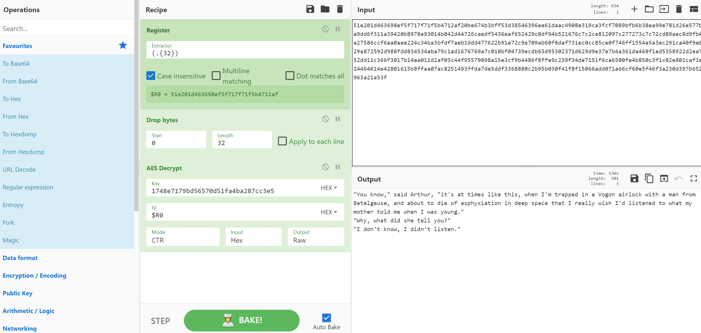

<!-- generated -->

# CyberChef

1-Click installation template for CyberChef on Easypanel

## Description

CyberChef is a simple, intuitive web app for carrying out all manner of &#39;cyber&#39; operations within a web browser. It allows users to perform various operations such as encoding, encryption, compression, hashing, parsing, and more. The tool is designed to be user-friendly and accessible to both technical and non-technical users.

## Benefits

- Easy to use: CyberChef provides a simple and intuitive interface that allows users to easily perform complex cyber operations without the need for complex tools or algorithms.
- Wide range of operations: CyberChef supports a wide range of operations, including encoding, encryption, compression, hashing, parsing, and more. Users can combine multiple operations to achieve their desired results.
- Automatic encoding detection: CyberChef uses advanced techniques to automatically detect the encoding of data, making it easier for users to work with different types of data without manual intervention.
- Drag and drop functionality: CyberChef supports drag and drop functionality, allowing users to easily load data from files or move operations within the recipe list.
- Save and load recipes: Users can save their recipes for future use and easily share them with others. Recipes can be saved locally or copied as a URL, including the input and recipe configuration.

## Features

- Drag and drop: Operations and files can be dragged and dropped within the app, making it easy to rearrange the recipe or load data from files.
- Auto Bake: CyberChef automatically updates the output whenever the input or recipe is modified, providing real-time results without manual intervention.
- Automated encoding detection: CyberChef uses advanced techniques to automatically detect the encoding of data, allowing users to easily decode and work with different types of data.
- Breakpoints and step-through execution: Users can set breakpoints on operations in the recipe and step through the execution to inspect the data at each stage.
- Save and load recipes: Users can save their recipes for future use and easily load them from local storage. Recipes can also be shared by copying the URL.
- Search and highlighting: Users can search for specific operations and highlight text in the input or output to see the corresponding data.
- Save to file and load from file: Users can save the output to a file or load a file into the input field by dragging and dropping. Large files up to 2GB are supported.
- Client-side processing: All processing in CyberChef is carried out within the user's browser, ensuring data privacy and security. The app can also be downloaded and run locally.
- Deep linking: CyberChef supports deep linking, allowing users to change the initial settings of the app by manipulating the URL hash.
- Browser and Node.js support: CyberChef is built to support Google Chrome 50+, Mozilla Firefox 38+, and Node.js v16. It can be used both in the browser and as a Node.js module.

## Links

- [Documentation](https://github.com/gchq/CyberChef/wiki)
- [Github](https://github.com/gchq/CyberChef)
- [Template Source](https://github.com/easypanel-io/templates/tree/main/templates/cyberchef)

## Options

Name | Description | Required | Default Value
-|-|-|-
App Service Name | - | yes | cyberchef
App Service Image | - | yes | mpepping/cyberchef:v10.4.0

## Screenshots

## Change Log

- 2023-2-9 – first release

## Contributors

- [Supernova3339](https://github.com/Supernova3339)
