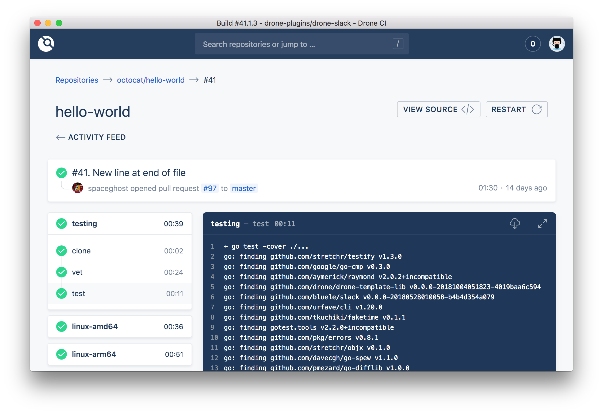

<!-- generated -->

# Drone

1-Click installation template for Drone on Easypanel

## Description

Drone.io is a self-service Continuous Integration platform for busy development teams. It allows teams to automate software build and testing processes.

## Benefits

- Configuration as a code: Pipelines are configured with a simple, easy-to-read file that you commit to your git repository.
- Any Source Code Manager: Drone integrates seamlessly with multiple source code management systems, including GitHub, GitHub Enterprise, Bitbucket, and GitLab.
- Any Platform: Drone natively supports multiple operating systems and architectures, including Linux x64, ARM, ARM64, and Windows x64.
- Any Language: Drone works with any language, database, or service that runs inside a Docker container.
- Create & Share Plugins: Drone uses containers to drop pre-configured steps into your pipeline. Choose from hundreds of existing plugins or create your own.
- Customization When You Need It: Drone makes advanced customization easy. Implement custom access controls, approval workflows, secret management, YAML syntax extensions, and more.
- Simple Configuration: Don’t waste time configuring your build servers. Choose from thousands of Docker images and Drone will auto-provision your environment.
- Isolated Builds: Don’t worry about conflicting builds on shared servers. Every build runs in an isolated Docker container, giving you full control.
- Effortless Scaling: Drone installs from a single binary and scales automatically.

## Features

- Configuration as a code: Pipelines are configured with a simple, easy-to-read file that you commit to your git repository.
- Any Source Code Manager: Drone integrates seamlessly with multiple source code management systems, including GitHub, GitHub Enterprise, Bitbucket, and GitLab.
- Any Platform: Drone natively supports multiple operating systems and architectures, including Linux x64, ARM, ARM64, and Windows x64.
- Any Language: Drone works with any language, database, or service that runs inside a Docker container.
- Create & Share Plugins: Drone uses containers to drop pre-configured steps into your pipeline. Choose from hundreds of existing plugins or create your own.
- Customization When You Need It: Drone makes advanced customization easy. Implement custom access controls, approval workflows, secret management, YAML syntax extensions, and more.
- Simple Configuration: Don’t waste time configuring your build servers. Choose from thousands of Docker images and Drone will auto-provision your environment.
- Isolated Builds: Don’t worry about conflicting builds on shared servers. Every build runs in an isolated Docker container, giving you full control.
- Effortless Scaling: Drone installs from a single binary and scales automatically.

## Links

- [Website](https://drone.io/)
- [Documentation](https://github.com/harness/drone#setup-documentation)
- [Github](https://github.com/harness/drone)
- [Template Source](https://github.com/easypanel-io/templates/tree/main/templates/drone)

## Options

Name | Description | Required | Default Value
-|-|-|-
App Service Name | - | yes | drone
App Service Image | - | yes | drone/drone:2.16.0
Runner Service Name | - | yes | drone-runner
Runner Service Image | - | yes | drone/drone-runner-docker:1.8.3
GitHub OAuth Client ID | - | yes | 
GitHub OAuth Client Secret | - | yes | secret
RPC Host | - | yes | 
RPC Protocol | - | yes | https
Install Runner Service | - | no | false
Capacity for runner if enabled | - | no | 2

## Screenshots

## Change Log

- 2022-08-04 – first release

## Contributors

- [Ivan Ryan](https://github.com/ivanonpc-22)
