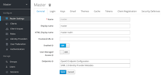

<!-- generated -->

# Keycloak

1-Click installation template for Keycloak on Easypanel

## Description

Keycloak is an open-source Identity and Access Management (IAM) solution that provides authentication, authorization, and user management for applications and services. It allows you to add authentication to your applications with minimum effort, eliminating the need to store and authenticate users. Keycloak supports single sign-on, enabling users to authenticate once and access multiple applications without having to log in again. It also supports identity brokering, allowing users to log in with social networks or existing identity providers. Keycloak provides centralized management through an admin console, where administrators can configure identity brokering, user federation, and fine-grained authorization policies. Users can manage their own accounts through the account management console, where they can update their profile, change passwords, and set up two-factor authentication. Keycloak is based on standard protocols such as OpenID Connect, OAuth 2.0, and SAML, and it offers high performance, scalability, and customization options through themes and extensions.

## Benefits

- Single Sign-On: Users authenticate with Keycloak once and can access multiple applications without having to log in again.
- Identity Brokering and Social Login: Keycloak supports login with social networks and existing identity providers, making it easy to integrate with external authentication systems.
- User Federation: Keycloak can connect to existing LDAP or Active Directory servers, or you can implement your own user provider.
- Centralized Management: Administrators can manage all aspects of the Keycloak server through the admin console, including identity brokering, user federation, and fine-grained authorization.
- Standard Protocols: Keycloak is based on standard protocols such as OpenID Connect, OAuth 2.0, and SAML, ensuring compatibility with a wide range of applications and services.

## Features

- Single-Sign On: Users authenticate with Keycloak rather than individual applications, eliminating the need for separate login forms and user authentication.
- Identity Brokering and Social Login: Keycloak supports login with social networks and existing OpenID Connect or SAML 2.0 identity providers, simplifying the authentication process for users.
- User Federation: Keycloak has built-in support for connecting to existing LDAP or Active Directory servers, and you can implement your own provider for other user stores.
- Admin Console: Administrators can centrally manage all aspects of the Keycloak server through the admin console, including identity brokering, user federation, application management, and fine-grained authorization.
- Account Management Console: Users can manage their own accounts through the account management console, where they can update their profile, change passwords, and set up two-factor authentication.
- Standard Protocols: Keycloak is based on standard protocols such as OpenID Connect, OAuth 2.0, and SAML, ensuring compatibility with a wide range of applications and services.
- Authorization Services: In addition to role-based authorization, Keycloak provides fine-grained authorization services, allowing you to define custom policies for managing permissions.

## Links

- [Website](https://www.keycloak.org)
- [Documentation](https://www.keycloak.org/documentation)
- [Github](https://github.com/keycloak/keycloak)
- [Template Source](https://github.com/easypanel-io/templates/tree/main/templates/keycloak)

## Options

Name | Description | Required | Default Value
-|-|-|-
App Service Name | - | yes | keycloak
App Service Image | - | yes | bitnami/keycloak:21.1.1
Database Service Name | - | yes | keycloak-db
Username | - | yes | 
Password | - | yes | 

## Screenshots

## Change Log

- 2023-3-16 – first release

## Contributors

- [Supernova3339](https://github.com/Supernova3339)
