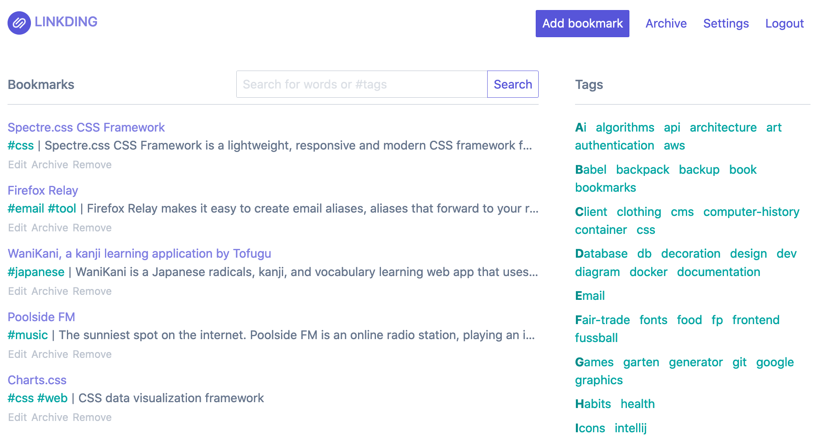

<!-- generated -->

# linkding

1-Click installation template for linkding on Easypanel

## Description

linkding is a self-hosted bookmark manager that is designed to be minimal, fast, and easy to set up using Docker. It provides a clean UI optimized for readability and allows users to organize bookmarks with tags, add notes using Markdown, and use read-it-later functionality. Users can also share bookmarks with other users, perform bulk editing, and automatically create snapshots of bookmarked websites on the Internet Archive Wayback Machine. linkding supports importing and exporting bookmarks in Netscape HTML format and provides extensions for Firefox and Chrome, as well as a bookmarklet. It also offers a REST API for developing third-party apps and an admin panel for user self-service and raw data access. linkding can be installed using Docker or Docker Compose, and it supports both SQLite and PostgreSQL databases. Managed hosting options are available for users who prefer a more convenient solution. The application is open source and built using the Django web framework.

## Instructions

If the login fails with a error 500, please restart the &quot;linkding&quot; app service. This can be caused by the database not being properly reachable at linkding&#39;s first start.

## Benefits

- Minimal and Fast: linkding is designed to be minimal and fast, providing a clean UI optimized for readability.
- Easy Setup with Docker: linkding can be easily set up using Docker, allowing users to quickly deploy the application.
- Bookmark Organization: linkding allows users to organize bookmarks with tags, making it easy to find and manage saved links.
- Read-it-Later Functionality: linkding provides read-it-later functionality, allowing users to save links for later reading.
- Bookmark Sharing: linkding allows users to share bookmarks with other users, making it easy to collaborate and discover new content.
- Bulk Editing: linkding supports bulk editing, allowing users to perform actions on multiple bookmarks at once.
- Automatic Website Snapshots: linkding automatically creates snapshots of bookmarked websites on the Internet Archive Wayback Machine, ensuring that users can access saved content even if the original website is no longer available.
- Import and Export Bookmarks: linkding supports importing and exporting bookmarks in Netscape HTML format, making it easy to migrate data to and from other bookmark managers.
- Extensions and Bookmarklet: linkding provides extensions for Firefox and Chrome, as well as a bookmarklet, allowing users to quickly add bookmarks from their browsers.
- REST API: linkding offers a REST API for developing third-party apps, allowing users to extend the functionality of the application.
- Admin Panel: linkding provides an admin panel for user self-service and raw data access, giving users control over their data.
- Multiple Database Options: linkding supports both SQLite and PostgreSQL databases, giving users flexibility in choosing their preferred database solution.
- Managed Hosting Options: For users who prefer a more convenient solution, linkding offers managed hosting options provided by third-party services.
- Open Source: linkding is an open-source application built using the Django web framework, allowing users to modify and contribute to the codebase.

## Features

- Clean UI optimized for readability: linkding provides a clean UI optimized for readability, making it easy to navigate and manage bookmarks.
- Organize bookmarks with tags: linkding allows users to organize bookmarks with tags, making it easy to categorize and find saved links.
- Add notes using Markdown: linkding supports adding notes to bookmarks using Markdown, allowing users to add additional context or information to saved links.
- Read-it-Later functionality: linkding provides read-it-later functionality, allowing users to save links for later reading.
- Share bookmarks with other users: linkding allows users to share bookmarks with other users, making it easy to collaborate and discover new content.
- Bulk editing: linkding supports bulk editing, allowing users to perform actions on multiple bookmarks at once.
- Automatic website snapshots: linkding automatically creates snapshots of bookmarked websites on the Internet Archive Wayback Machine, ensuring that users can access saved content even if the original website is no longer available.
- Import and export bookmarks: linkding supports importing and exporting bookmarks in Netscape HTML format, making it easy to migrate data to and from other bookmark managers.
- Extensions for Firefox and Chrome, as well as a bookmarklet: linkding provides extensions for Firefox and Chrome, as well as a bookmarklet, allowing users to quickly add bookmarks from their browsers.
- Light and dark themes: linkding offers light and dark themes, allowing users to customize the appearance of the application.
- REST API for developing third-party apps: linkding offers a REST API for developing third-party apps, allowing users to extend the functionality of the application.
- Admin panel for user self-service and raw data access: linkding provides an admin panel for user self-service and raw data access, giving users control over their data.
- Easy setup using Docker and a SQLite database, with PostgreSQL as an option: linkding can be easily set up using Docker and a SQLite database. PostgreSQL is also supported as an alternative database option.

## Links

- [Github](https://github.com/sissbruecker/linkding)
- [Demo](https://demo.linkding.link/)
- [Template Source](https://github.com/easypanel-io/templates/tree/main/templates/linkding)

## Options

Name | Description | Required | Default Value
-|-|-|-
App Service Name | - | yes | linkding
App Service Image | - | yes | sissbruecker/linkding:1.17.2
Superuser Name | - | yes | 
Superuser Password | - | yes | 
Disable background tasks | - | no | false
Disable URL validation | - | no | false
Database Type | - | yes | sqlite
Database Service Name (Can be ignored if SQLite) | - | yes | linkding-db

## Screenshots

## Change Log

- 2023-03-18 – Template created (v1.17.2)

## Contributors

- [Ponkhy](https://github.com/Ponkhy)
