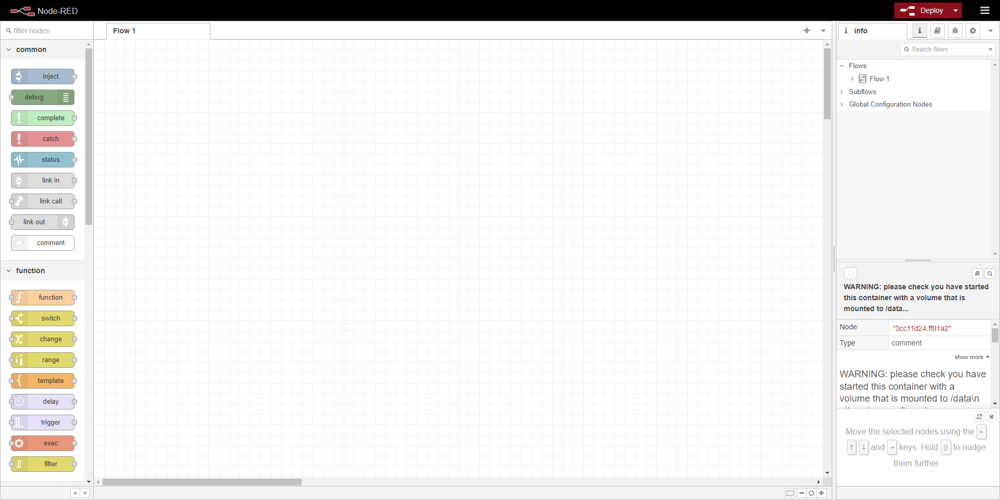

<!-- generated -->

# Node-RED

1-Click installation template for Node-RED on Easypanel

## Description

Node-RED is a programming tool for wiring together hardware devices, APIs, and online services in new and interesting ways. It provides a browser-based editor that makes it easy to wire together flows using the wide range of nodes in the palette that can be deployed to its runtime in a single-click.

## Benefits

- Browser-based flow editing: Node-RED provides a browser-based flow editor that makes it easy to wire together flows using the wide range of nodes in the palette. Flows can be then deployed to the runtime in a single-click. JavaScript functions can be created within the editor using a rich text editor. A built-in library allows you to save useful functions, templates or flows for re-use.
- Built on Node.js: The light-weight runtime is built on Node.js, taking full advantage of its event-driven, non-blocking model. This makes it ideal to run at the edge of the network on low-cost hardware such as the Raspberry Pi as well as in the cloud. With over 225,000 modules in Node's package repository, it is easy to extend the range of palette nodes to add new capabilities.
- Social Development: The flows created in Node-RED are stored using JSON which can be easily imported and exported for sharing with others. An online flow library allows you to share your best flows with the world.

## Features

- Browser-based flow editing: Node-RED provides a browser-based flow editor that makes it easy to wire together flows using the wide range of nodes in the palette. Flows can be then deployed to the runtime in a single-click. JavaScript functions can be created within the editor using a rich text editor. A built-in library allows you to save useful functions, templates or flows for re-use.
- Built on Node.js: The light-weight runtime is built on Node.js, taking full advantage of its event-driven, non-blocking model. This makes it ideal to run at the edge of the network on low-cost hardware such as the Raspberry Pi as well as in the cloud. With over 225,000 modules in Node's package repository, it is easy to extend the range of palette nodes to add new capabilities.

## Links

- [Website](https://nodered.org/)
- [Documentation](https://nodered.org/docs/)
- [Forum](https://discourse.nodered.org/)
- [Github](https://github.com/node-red)
- [Template Source](https://github.com/easypanel-io/templates/tree/main/templates/nodered)

## Options

Name | Description | Required | Default Value
-|-|-|-
App Service Name | - | yes | nodered
App Service Image | - | yes | nodered/node-red:3.0.2

## Screenshots

## Change Log

- 2022-10-28 – first release

## Contributors

- [Supernova3339](https://github.com/Supernova3339)
