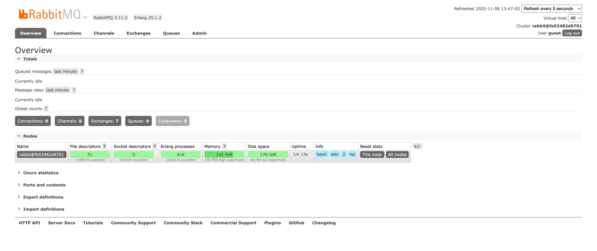

<!-- generated -->

# RabbitMQ

1-Click installation template for RabbitMQ on Easypanel

## Description

RabbitMQ is an open source message broker that is widely deployed and used by small startups and large enterprises worldwide. It is lightweight and easy to deploy on premises and in the cloud, and supports multiple messaging protocols and streaming. RabbitMQ can be deployed in distributed and federated configurations to meet high-scale, high-availability requirements. It runs on many operating systems and cloud environments, and provides a wide range of developer tools for most popular languages. RabbitMQ offers features such as asynchronous messaging, cross-language messaging, distributed deployment, pluggable authentication and authorization, and management and monitoring tools. It also has commercial features like intra-cluster compression, warm standby replication, and 24/7 expert support. RabbitMQ can be downloaded and installed on popular operating systems and languages, and there are tutorials available to help users get started. Commercial offerings and support agreements are available from VMware, and technical support and cloud hosting are provided by various companies. There is a vibrant community around RabbitMQ with mailing lists, Discord server, and Slack channel for users to connect and get help. Contributions to RabbitMQ are welcome from the community.

## Instructions

Default user/pass is guest/guest (if you use the -management version of the image)

## Benefits

- Widely Deployed: RabbitMQ is used by tens of thousands of users worldwide, from small startups to large enterprises.
- Lightweight and Easy to Deploy: RabbitMQ is lightweight and easy to deploy on premises and in the cloud.
- Supports Multiple Messaging Protocols: RabbitMQ supports multiple messaging protocols and streaming.
- High-Scale and High-Availability: RabbitMQ can be deployed in distributed and federated configurations to meet high-scale, high-availability requirements.
- Wide Range of Developer Tools: RabbitMQ provides a wide range of developer tools for most popular languages.

## Features

- Asynchronous Messaging: RabbitMQ supports multiple messaging protocols, message queuing, delivery acknowledgement, flexible routing to queues, and multiple exchange types.
- Cross-Language Messaging: RabbitMQ allows developers to develop cross-language messaging with their favorite programming languages such as Java, .NET, PHP, Python, JavaScript, Ruby, Go, and many others.
- Distributed Deployment: RabbitMQ can be deployed as clusters for high availability and throughput, and can be federated across multiple availability zones and regions.
- Pluggable Authentication and Authorization: RabbitMQ supports pluggable authentication and authorization, and also supports TLS and LDAP.
- Management and Monitoring Tools: RabbitMQ provides HTTP-API, command line tool, and UI for managing and monitoring the message broker.
- Intra-Cluster Compression: RabbitMQ compresses all network traffic exchanged by nodes in a deployment by default, reducing bandwidth usage by 16x for JSON message payloads.
- Warm Standby Replication: RabbitMQ supports continuous schema definition and message replication to a remote cluster, making it easy to run a standby cluster for disaster recovery.
- 24/7 Expert Support: RabbitMQ offers 24/7 expert support with phone and online global coverage, gold star standards SLAs, and extended support lifecycle.

## Links

- [Website](https://www.rabbitmq.com/)
- [Documentation](https://www.rabbitmq.com/documentation.html)
- [Github](https://github.com/rabbitmq/rabbitmq-server/)
- [Template Source](https://github.com/easypanel-io/templates/tree/main/templates/rabbitmq)

## Options

Name | Description | Required | Default Value
-|-|-|-
App Service Name | - | yes | rabbitmq
App Service Image | - | no | 
Enable RabbitMQ Management UI Plugin (modifies image) | - | no | 
Default User Name | - | no | 
Default User Password | - | no | 
RAM Memory Limit (recommended) | - | yes | 512MB

## Screenshots

## Change Log

- 2022-11-08 – first release

## Contributors

- [Rubén Robles](https://github.com/D8vjork)
