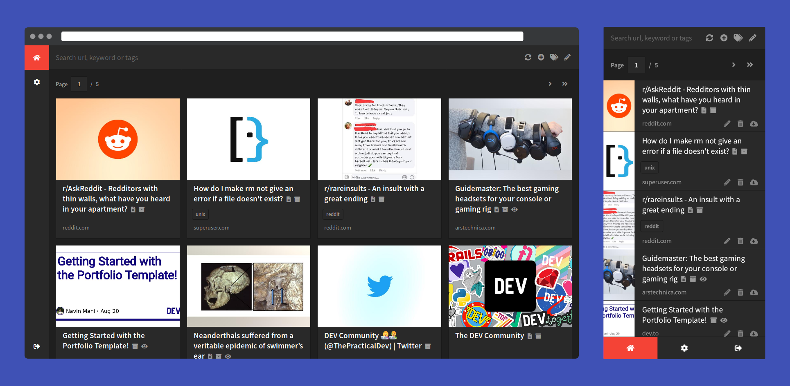

<!-- generated -->

# Shiori

1-Click installation template for Shiori on Easypanel

## Description

Shiori is a simple bookmarks manager written in the Go language. It is intended as a simple clone of Pocket and can be used as a command line application or as a web application. It supports basic bookmarks management, import and export of bookmarks, a simple and clean command line interface, a simple and pretty web interface, and is portable thanks to its single binary format. It also supports multiple databases and can create offline archives of webpages. There is also a web extension available for managing bookmarks using Shiori.

## Instructions

The default account is &quot;shiori&quot; with password &quot;gopher&quot;. It is removed once another &quot;owner&quot; account is created.

## Benefits

- Simple and Easy to Use: Shiori provides a simple and clean interface for managing bookmarks, making it easy to add, edit, delete, and search for bookmarks.
- Portable and Easy to Install: Shiori is distributed as a single binary, which means it can be easily installed and used on any system without the need for complex setup or dependencies.
- Supports Multiple Databases: Shiori supports sqlite3, PostgreSQL, and MySQL as its database, giving you the flexibility to choose the database that works best for you.
- Web Extension Support: Shiori has a web extension available for Firefox and Chrome, allowing you to save and remove bookmarks in Shiori without switching from your current page.

## Features

- Basic Bookmarks Management: Shiori allows you to add, edit, delete, and search for bookmarks, providing a simple and efficient way to manage your bookmarks.
- Import and Export Bookmarks: Shiori supports importing and exporting bookmarks from and to Netscape Bookmark file, as well as importing bookmarks from Pocket.
- Command Line and Web Interface: Shiori can be used as a command line application or as a web application, providing flexibility in how you interact with your bookmarks.
- Offline Archive of Webpages: Shiori can parse the readable content of webpages and create an offline archive, allowing you to access the content even when you are offline.

## Links

- [Github](https://github.com/go-shiori/shiori)
- [Web Extension](https://github.com/go-shiori/shiori-web-ext)
- [Template Source](https://github.com/easypanel-io/templates/tree/main/templates/shiori)

## Options

Name | Description | Required | Default Value
-|-|-|-
App Service Name | - | yes | shiori
App Service Image | - | yes | ghcr.io/go-shiori/shiori:v1.5.4
Database Service Name | - | yes | shiori-db

## Screenshots

## Change Log

- 2023-03-17 – Template created (v1.5.4)

## Contributors

- [Ponkhy](https://github.com/Ponkhy)
