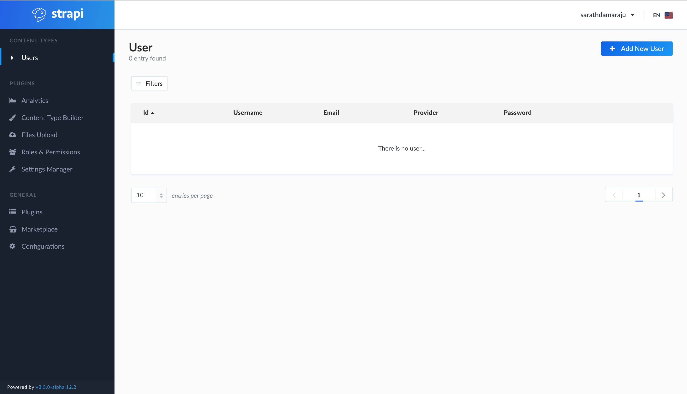

<!-- generated -->

# Strapi

1-Click installation template for Strapi on Easypanel

## Description

Strapi is an open-source headless CMS that allows developers to build customizable content APIs and use them with a modern tech stack. It offers a flexible data structure, easy content management, and the ability to integrate with various frameworks and tools. Strapi can be deployed on Strapi Cloud or on any cloud platform, giving users control and no vendor lock-in.

## Benefits

- Build apps fast: Get your backend done in minutes instead of weeks. Easily build customizable content API and use them with a modern tech stack.
- Open Source Forever: The entire codebase is available on GitHub and maintained by hundreds of contributors.
- Customizable: Easily customize the admin panel as well as the API. Extend your content management with custom plugins, in seconds.
- RESTful or GraphQL: Consume the API from any client (React, Vue, Angular), mobile apps or even IoT devices, using REST or GraphQL.
- Self-hosted or Cloud: Extend the capabilities of Strapi with Strapi Cloud, our fully managed platform or deploy on-premises, on your favorite public cloud or the PaaS of your choice. You’re in control, no lock-in.

## Features

- Effortlessly create content structures: Define models and add relations to create rich layout experiences.
- Seamlessly write, edit and manage any content types: Deliver content faster no matter your industries, use cases, locations, devices, and channels.
- Easily build apps and digital experiences: Integrate individual best-in-class services by third-party vendors and connect any framework of your choice.
- Consume Strapi API from any client: Use a standard RESTful API or GraphQL to query your content.
- Deploy on Strapi Cloud or on any cloud platforms: Strapi can be deployed on Strapi Cloud or on services such as 21YunBox, Render, AWS, Azure, and others or locally using Docker.

## Links

- [Website](https://strapi.io/)
- [Documentation](https://docs.strapi.io/developer-docs/latest/getting-started/introduction.html)
- [Github](https://github.com/strapi)
- [Template Source](https://github.com/easypanel-io/templates/tree/main/templates/strapi)

## Options

Name | Description | Required | Default Value
-|-|-|-
App Service Name | - | yes | strapi
App Service Image | - | yes | strapi/strapi:3.6.8-alpine
Database Type | - | yes | sqlite
Database Service Name | - | yes | strapi-db

## Screenshots

## Change Log

- 2022-07-12 – first release

## Contributors

- [Ponkhy](https://github.com/Ponkhy)
- [Andrei Canta](https://github.com/deiucanta)
